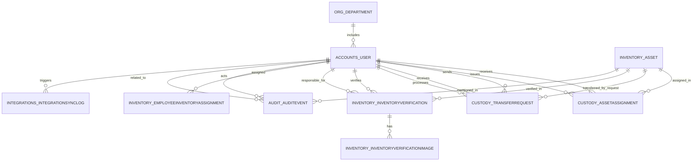

# Архитектура базы данных `my.inventory`

## 1. Назначение базы данных

База данных программного продукта `my.inventory` предназначена для централизованного хранения сведений о сотрудниках, организационной структуре, товарно-материальных ценностях, операциях выдачи и возврата имущества, передаче ТМЦ между сотрудниками, инвентаризационных проверках, событиях аудита, а также параметрах внешних интеграций.

База данных является ядром всей информационной системы, так как именно в ней фиксируется текущее состояние объектов учета и сохраняется история изменения этих состояний. Серверная часть приложения Django использует базу данных PostgreSQL через ORM-слой Django.

## 2. Общий архитектурный подход

Архитектура базы данных построена по реляционной модели. В качестве СУБД используется PostgreSQL, что обусловлено следующими причинами:

- поддержка транзакций и ссылочной целостности;
- надежная работа с внешними ключами и ограничениями;
- поддержка JSON-полей для хранения служебных метаданных;
- хорошая совместимость с Django ORM;
- удобство резервного копирования и сопровождения.

С логической точки зрения база данных разделена на несколько предметных подсистем:

- кадровая подсистема;
- организационно-справочная подсистема;
- подсистема учета ТМЦ;
- подсистема движения ТМЦ;
- подсистема инвентаризации;
- подсистема аудита;
- подсистема интеграций;
- системные таблицы Django и PostgreSQL.

Такой подход соответствует архитектуре модульного монолита: приложение остается единым, но данные внутри него организованы по функциональным областям.

## 3. Принципы проектирования

При проектировании базы данных использованы следующие принципы:

- каждая предметная сущность представлена отдельной таблицей;
- для идентификации записей используются суррогатные первичные ключи типа `BigAutoField`;
- связи между сущностями реализуются через внешние ключи;
- дублирование данных минимизировано, а основная часть структуры соответствует нормализованной модели;
- для важных бизнес-объектов используются уникальные ограничения;
- для истории операций используются отдельные таблицы, а не перезапись уже существующих данных;
- для большинства таблиц применяется единый шаблон полей `created_at` и `updated_at`, что повышает трассируемость изменений.

В проекте также применяется компромисс между строгой нормализацией и практичностью. Например, отдельные значения локации в некоторых операционных таблицах хранятся как текстовые поля, чтобы сохранить историческое значение на момент операции, даже если справочник локаций будет изменен позднее.

## 4. Логическая структура базы данных

### 4.1. Подсистема пользователей

Основной таблицей подсистемы пользователей является `accounts_user`. Она реализована на основе расширенной пользовательской модели Django и хранит учетные данные сотрудников и их служебные атрибуты.

Ключевые поля таблицы:

- `id` — первичный ключ;
- `username` — логин пользователя;
- `email` — уникальный адрес электронной почты;
- `last_name`, `first_name`, `middle_name` — ФИО;
- `phone` — контактный телефон;
- `role` — бизнес-роль сотрудника;
- `position` — должность;
- `office_location` — текстовое обозначение рабочей локации;
- `department_id` — ссылка на отдел;
- `is_active`, `is_staff`, `is_superuser` — системные атрибуты доступа;
- `created_at`, `updated_at` — даты создания и изменения записи.

Связь с отделом реализована как `many-to-one`: один отдел может включать многих сотрудников.

Дополнительно в системе используются стандартные таблицы Django:

- `auth_group`;
- `auth_permission`;
- `accounts_user_groups`;
- `accounts_user_user_permissions`.

Они обеспечивают разграничение прав доступа и ролевую модель управления системой.

### 4.2. Организационно-справочная подсистема

Организационная структура представлена двумя основными таблицами:

- `org_department`;
- `org_location`.

Таблица `org_department` хранит сведения об отделах:

- `id`;
- `name` — уникальное название отдела;
- `code` — код отдела;
- `location` — базовая локация отдела в текстовом виде;
- `created_at`, `updated_at`.

Таблица `org_location` хранит сведения о локациях:

- `id`;
- `name` — уникальное название локации;
- `code` — код локации;
- `address` — адрес или описание;
- `created_at`, `updated_at`.

Данная подсистема используется как справочник для кадрового блока и административного интерфейса.

### 4.3. Подсистема учета ТМЦ

Центральной таблицей учета имущества является `inventory_asset`.

Она содержит:

- `id`;
- `category` — категория ТМЦ;
- `title` — наименование;
- `model_name` — модель;
- `inventory_number` — уникальный инвентарный номер;
- `serial_number` — серийный номер;
- `status` — текущее состояние ТМЦ;
- `location` — текущее местоположение;
- `last_verified_at` — дата последней проверки;
- `next_verification_date` — дата следующей проверки;
- `notes` — примечание;
- `created_at`, `updated_at`.

Эта таблица отражает текущее состояние единицы учета. Для хранения истории выдачи, передачи и проверок используются отдельные связанные таблицы.

### 4.4. Подсистема движения ТМЦ

Подсистема движения ТМЦ включает две основные таблицы:

- `custody_assetassignment`;
- `custody_transferrequest`.

Таблица `custody_assetassignment` фиксирует факт закрепления ТМЦ за сотрудником:

- `asset_id` — ссылка на ТМЦ;
- `employee_id` — ссылка на сотрудника;
- `assigned_by_id` — кто выдал имущество;
- `assigned_at` — дата и время выдачи;
- `returned_at` — дата и время возврата;
- `location_at_issue` — локация на момент выдачи;
- `note` — служебный комментарий;
- `is_current` — признак актуального закрепления.

Для этой таблицы реализовано частичное уникальное ограничение `unique_current_asset_assignment`, которое гарантирует, что у одной единицы ТМЦ не может быть более одного активного закрепления одновременно.

Таблица `custody_transferrequest` хранит заявки на передачу имущества:

- `asset_id`;
- `from_employee_id`;
- `to_employee_id`;
- `status`;
- `comment`;
- `requested_at`;
- `processed_at`;
- `processed_by_id`;
- `created_at`, `updated_at`.

Данная таблица позволяет хранить как незавершенные, так и уже обработанные запросы на передачу имущества между сотрудниками.

### 4.5. Подсистема инвентаризации

Инвентаризационный блок включает три таблицы:

- `inventory_inventoryverification`;
- `inventory_inventoryverificationimage`;
- `inventory_employeeinventoryassignment`.

Таблица `inventory_inventoryverification` хранит результаты фактической проверки ТМЦ:

- `asset_id` — проверяемая единица имущества;
- `verified_at` — дата и время проверки;
- `verified_by_id` — кто выполнил фиксацию;
- `responsible_employee_id` — материально ответственное лицо;
- `location` — место фактического нахождения;
- `next_verification_date` — плановая дата следующей проверки;
- `notes` — комментарий;
- `created_at`, `updated_at`.

Таблица `inventory_inventoryverificationimage` содержит фотофиксацию результатов проверки:

- `verification_id` — ссылка на запись инвентаризации;
- `image` — путь к изображению;
- `caption` — подпись;
- `sort_order` — порядок отображения;
- `created_at`, `updated_at`.

Связь между таблицами `inventory_inventoryverification` и `inventory_inventoryverificationimage` имеет тип `one-to-many`: одна проверка может иметь несколько изображений.

Таблица `inventory_employeeinventoryassignment` предназначена для назначения сотруднику периода инвентаризации:

- `employee_id`;
- `assigned_by_id`;
- `revoked_by_id`;
- `date_from`;
- `date_to`;
- `note`;
- `revoked_at`;
- `revocation_note`;
- `created_at`, `updated_at`.

Эта таблица позволяет формировать график сверок и хранить историю назначений и отзывов инвентаризационных периодов.

### 4.6. Подсистема аудита

Для журналирования действий используется таблица `audit_auditevent`.

Она содержит:

- `event_type` — тип события;
- `actor_id` — пользователь, выполнивший действие;
- `related_user_id` — пользователь, к которому относится событие;
- `asset_id` — объект ТМЦ, если событие связано с имуществом;
- `message` — текстовое описание события;
- `metadata` — JSON-структура с дополнительными параметрами;
- `occurred_at` — фактическое время события;
- `created_at`, `updated_at`.

Использование отдельной таблицы аудита повышает прозрачность работы системы и обеспечивает возможность последующего анализа действий пользователей.

### 4.7. Подсистема интеграций

После расширения системы в ней появились таблицы, обслуживающие интеграцию с 1С и Active Directory:

- `integrations_onecintegrationsettings`;
- `integrations_activedirectorysettings`;
- `integrations_integrationsynclog`.

Таблица `integrations_onecintegrationsettings` хранит параметры подключения к 1С:

- признак активности интеграции;
- базовый URL;
- учетные данные или токен;
- пути endpoint-ов;
- параметры таймаута и SSL;
- флаги синхронизации отделов, сотрудников и ТМЦ;
- дата последней синхронизации.

Таблица `integrations_activedirectorysettings` хранит параметры подключения к LDAP/Active Directory:

- сервер;
- домен;
- base DN;
- bind DN и пароль;
- шаблон LDAP-фильтра;
- имена LDAP-атрибутов;
- параметры SSL и таймаута;
- флаг синхронизации профиля при входе;
- дата последней проверки подключения.

Таблица `integrations_integrationsynclog` используется для журнала запусков интеграций:

- `integration_type`;
- `status`;
- `action`;
- `message`;
- `details` — JSON-метаданные;
- `started_at`;
- `finished_at`;
- `triggered_by_id`;
- `created_at`, `updated_at`.

Данный блок отделен от основного операционного контура и не влияет напрямую на предметные таблицы без явного запуска синхронизации или аутентификации.

## 5. Основные связи между таблицами

Ключевые связи базы данных можно представить следующим образом:

- `org_department` 1:M `accounts_user`;
- `accounts_user` 1:M `custody_assetassignment`;
- `inventory_asset` 1:M `custody_assetassignment`;
- `inventory_asset` 1:M `custody_transferrequest`;
- `accounts_user` 1:M `custody_transferrequest` как отправитель;
- `accounts_user` 1:M `custody_transferrequest` как получатель;
- `inventory_asset` 1:M `inventory_inventoryverification`;
- `inventory_inventoryverification` 1:M `inventory_inventoryverificationimage`;
- `accounts_user` 1:M `inventory_employeeinventoryassignment`;
- `accounts_user` 1:M `audit_auditevent`;
- `inventory_asset` 1:M `audit_auditevent`;
- `accounts_user` 1:M `integrations_integrationsynclog`.

Таким образом, ядром предметной схемы выступают три сущности:

- сотрудник;
- ТМЦ;
- операция над ТМЦ.

## 6. ER-диаграмма

Ниже приведена упрощенная ER-диаграмма предметной части базы данных:

## 7. Ограничения целостности

В базе данных реализованы следующие механизмы обеспечения целостности:

- уникальность `email` в таблице пользователей;
- уникальность `inventory_number` в таблице ТМЦ;
- уникальность названий отделов и локаций;
- ограничение на единственное активное закрепление одной ТМЦ за одним сотрудником в текущий момент;
- использование внешних ключей между операционными таблицами;
- применение стратегий `CASCADE` и `SET_NULL` в зависимости от бизнес-смысла связи.

Использование `SET_NULL` для части ссылок позволяет сохранять историю даже в тех случаях, когда связанный объект был деактивирован или изменен. Это особенно важно для аудита, инвентаризации и журналов интеграций.

## 8. Нормализация данных

Структура базы данных в основном соответствует третьей нормальной форме:

- сведения о сотрудниках выделены в отдельную таблицу;
- сведения об отделах и локациях хранятся отдельно от операций;
- карточки ТМЦ не содержат историю всех действий, а только текущее состояние;
- история движения, инвентаризации и аудита вынесена в самостоятельные таблицы;
- настройки интеграций отделены от предметных данных.

При этом часть полей хранится в денормализованном виде осознанно:

- `office_location` у сотрудника;
- `location` у отдела;
- `location` у ТМЦ;
- `location_at_issue` в закреплении;
- `location` в инвентаризационной записи.

Это сделано для сохранения исторического значения на момент операции и уменьшения зависимости исторических данных от последующих изменений в справочниках.

## 9. Физическая реализация

Физически база данных развертывается в PostgreSQL в составе Docker Compose-конфигурации проекта. Доступ к данным осуществляется только через серверное приложение Django. Прямое редактирование таблиц со стороны пользователя не предполагается.

В состав физической реализации входят:

- предметные таблицы приложения;
- системные таблицы Django (`django_migrations`, `django_session`, `django_admin_log` и другие);
- таблицы аутентификации и авторизации;
- индексы, создаваемые PostgreSQL и Django автоматически для первичных и внешних ключей.

Модификация схемы базы данных выполняется через механизм миграций Django, что обеспечивает контролируемое развитие структуры и воспроизводимость развертывания.

## 10. Транзакционность и согласованность

Для критически важных бизнес-операций серверная часть приложения использует транзакционный подход. Это особенно важно для следующих сценариев:

- выдача ТМЦ сотруднику;
- возврат ТМЦ;
- подтверждение передачи ТМЦ;
- фиксация инвентаризации;
- синхронизация данных из внешних систем.

Транзакционность позволяет исключить частичное выполнение операции. Например, невозможно корректно выдать имущество без одновременного обновления статуса ТМЦ, создания записи закрепления и фиксации события аудита.

## 11. Резервное копирование и сопровождение

Сопровождение базы данных предусмотрено инфраструктурой проекта. В репозитории присутствуют служебные сценарии резервного копирования и восстановления:

- `scripts/backup_db.sh`;
- `scripts/restore_db.sh`.

Это позволяет организовать регулярное сохранение данных и восстановление состояния системы при необходимости.

## 12. Вывод

База данных `my.inventory` представляет собой реляционную информационную структуру, ориентированную на надежный учет сотрудников, организационной структуры, карточек ТМЦ, операций движения имущества, результатов инвентаризации, событий аудита и данных внешних интеграций.

Выбранная архитектура обеспечивает:

- целостность и непротиворечивость данных;
- разделение текущего состояния и исторических событий;
- поддержку административных и пользовательских сценариев;
- расширяемость схемы без кардинальной перестройки всей системы;
- возможность дальнейшей интеграции с корпоративными системами, в том числе 1С и Active Directory.

Такая структура может быть использована как полноценная архитектура базы данных в дипломной работе, так как она отражает не абстрактную модель, а фактическую схему хранения данных программного продукта `my.inventory`.
